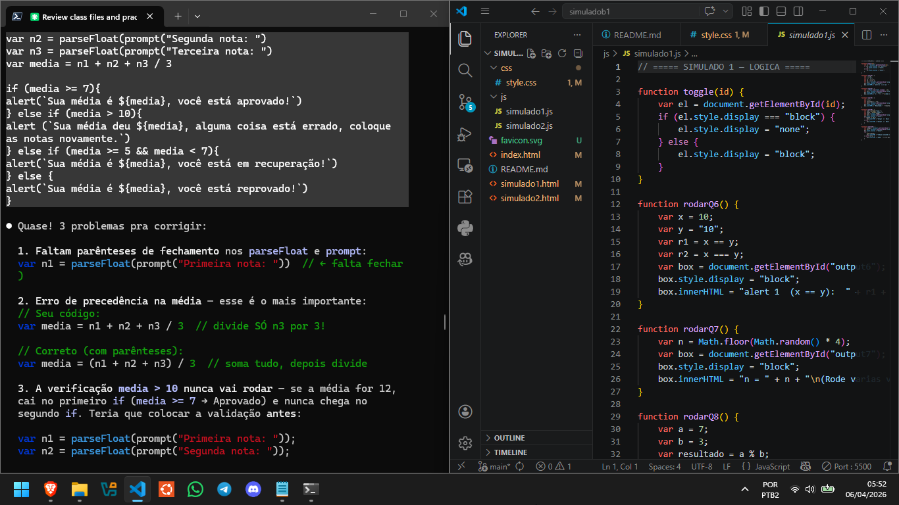
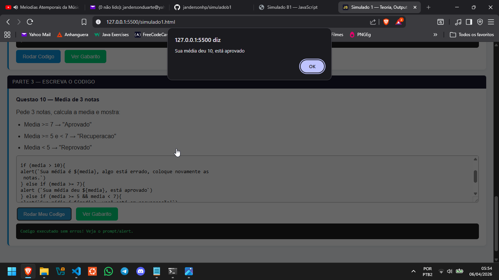
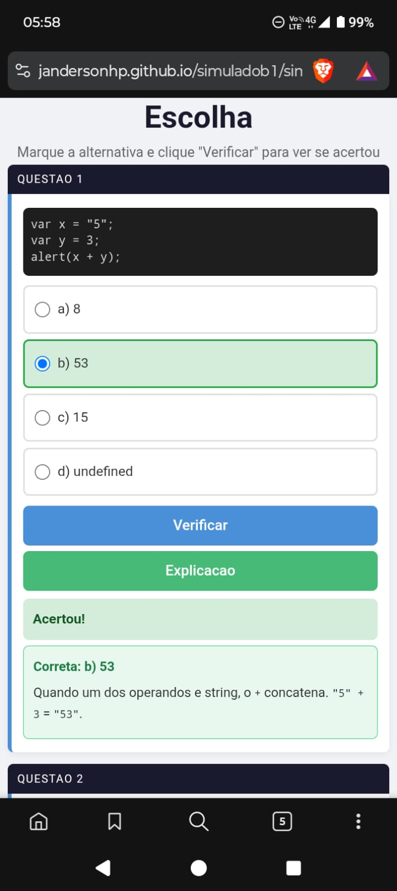
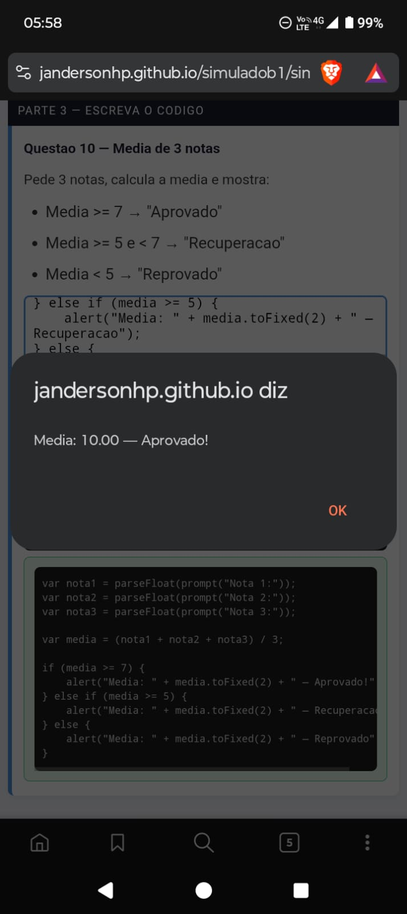

# Simulado B1 — Desenvolvimento em JavaScript

Site interativo para estudar a prova do **Professor Argentino**, criado para a turma de **Analise e Desenvolvimento de Sistemas — 3 semestre**.

Acesse em: [Landing Page](https://jandersonhp.github.io/simuladob1/)

> **Como este projeto foi feito:** Este site foi criado inteiramente com **OpenClaude** usado diretamente pelo terminal. Os arquivos dos exercícios das aulas (HTML escritos por uma colega) foram lidos pela IA, que gerou automaticamente os simulados interativos, o CSS responsivo e toda a estrutura do projeto. Enquanto a IA construía, eu respondia as questões diretamente no terminal e ia sendo corrigido em tempo real — uma sessão de estudo de verdade.

## O que tem aqui

| Arquivo | Conteudo |
|---------|----------|
| [Simulado 1](https://jandersonhp.github.io/simuladob1/simulado1.html) | Parte teorica (origem do JS), perguntas de output, e exercicio de escrever codigo |
| [Simulado 2](https://jandersonhp.github.io/simuladob1/simulado2.html) | 10 questoes de multipla escolha com verificacao interativa + exercicio de escrever codigo |

## Aprendendo com IA

  

## Responsivo no celular

## Temas cobrados

- Origem do JavaScript (Brendan Eich, Netscape, 1995)
- Variaveis, tipos e operadores
- Operadores de comparacao (`==` vs `===`)
- Operador modulo (`%`)
- Estruturas condicionais (`if / else if / else`)
- `Math.random()` e `Math.floor()`
- `prompt()`, `alert()`, `parseInt()`, `parseFloat()`
- Template literals e `.toFixed()`

## Como usar

Abra o `index.html` no navegador ou acesse via GitHub Pages. Responda no proprio site e verifique na hora se acertou.

## Licenca

Material criado para fins educacionais pela turma de ADS. Uso livre para estudo.
